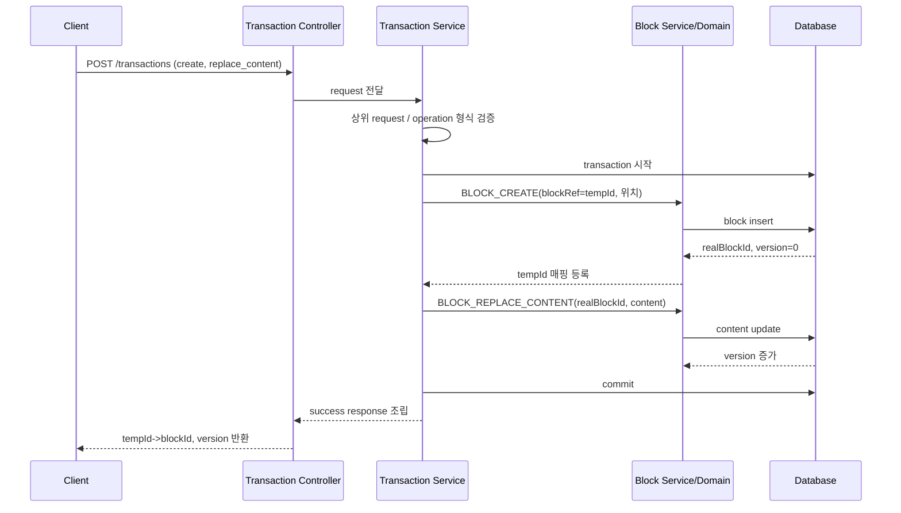
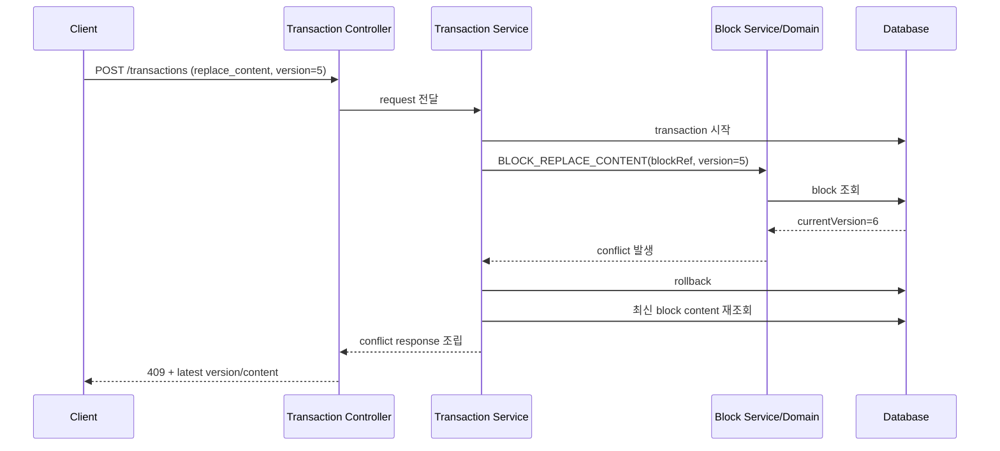
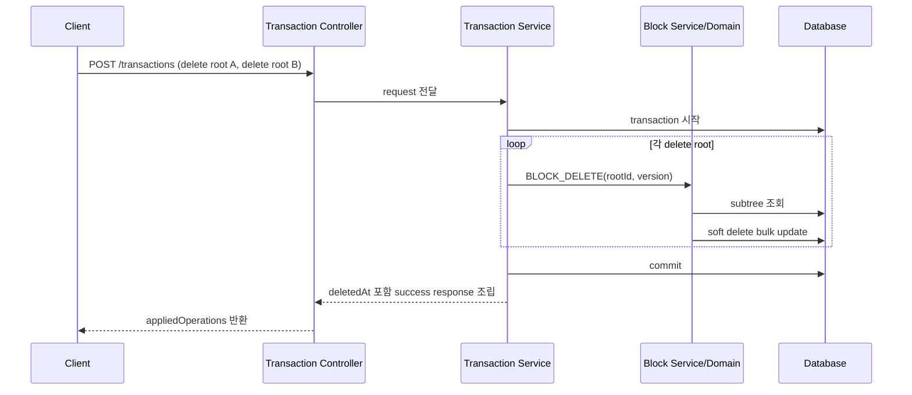

# Backend Editor Transaction Processing Guide

## 목적

이 문서는 백엔드 구현자가 프론트가 전처리해 보낸 editor transaction batch를 어떻게 받아 처리해야 하는지 정리한 문서다.

이 문서만 읽어도 다음을 이해할 수 있도록 작성한다.

- 백엔드가 어떤 책임을 가져야 하는가
- 프론트 queue와 백엔드 transaction 처리의 경계가 어디인가
- `POST /v1/documents/{documentId}/transactions`를 어떤 순서로 검증하고 반영해야 하는가
- `tempId`, `version`, conflict, rollback을 어떻게 다뤄야 하는가

관련 문서:

- `docs/explainers/editor-transaction-save-model.md`
- `docs/guides/frontend-editor-transaction-implementation-guide.md`
- `docs/discussions/2026-03-20-editor-transaction-dto-and-frontend-queue-spec.md`
- `docs/decisions/014-adopt-transaction-centered-editor-save-model.md`

---

## 1. 먼저 기억할 핵심

백엔드는 사용자의 원시 편집 이벤트를 다시 정리하는 queue 엔진이 아니다.

백엔드가 받는 것은 프론트가 queue에서 정리한 "최종 batch"다.

역할은 다음처럼 나뉜다.

### 프론트 책임

- 로컬 UI 즉시 반영
- operation queue 적재
- coalescing
- 상쇄
- debounce / max autosave interval / 명시적 flush 판단
- 최종 batch 조립

### 백엔드 책임

- request validation
- `tempId` 참조 해석
- version 검증
- 위치/정렬/삭제 정합성 검증
- 전체 rollback 또는 commit
- success/conflict 응답 조립

즉 백엔드는 create 후 delete 같은 중간 상태를 받아 다시 재조립하는 계층이 아니다.

---

## 2. 처리 전제

v1 전제는 다음과 같다.

- 에디터 표준 write 경로는 `POST /v1/documents/{documentId}/transactions`
- operation은 `BLOCK_CREATE`, `BLOCK_REPLACE_CONTENT`, `BLOCK_MOVE`, `BLOCK_DELETE` 4개
- `BLOCK_CREATE`는 위치만 다루고 본문은 다루지 않는다.
- 본문은 `BLOCK_REPLACE_CONTENT`가 담당한다.
- 모든 transaction operation은 블록 참조 필드로 `blockRef`를 사용한다.
- `BLOCK_CREATE`의 `blockRef`에는 새 block용 `tempId`를 넣는다.
- `blockRef`는 같은 batch 안의 새 block이면 `tempId`, 기존 block이면 실제 `blockId`다.
- 다만 서버 내부에서는 `blocks.content_json` not null 제약을 만족시키기 위해 `BLOCK_CREATE` 시 기본 empty structured content를 먼저 저장할 수 있다.
- 이 값은 외부 API 계약이 아니라 서버 영속 기본값이며, 같은 batch의 `BLOCK_REPLACE_CONTENT`가 오면 최종 본문으로 교체된다.
- 기존 block 수정/이동/삭제는 `version`이 필요하다.
- 실패 정책은 전체 rollback이다.

---

## 3. 처리 순서

### 1. 상위 request 검증

- `documentId` 활성 상태 확인
- `clientId` 존재 여부 확인
- `batchId` 존재 여부 확인
- `operations` 비어 있지 않은지 확인

### 2. operation 형식 검증

- 허용된 type인지
- 필수 필드가 빠지지 않았는지
- `version`이 필요한 op에 들어왔는지
- `content`가 structured content validation을 통과하는지

### 3. transaction 컨텍스트 생성

- 같은 batch 안에서 사용할 `tempId -> real block` 매핑 컨텍스트 준비
- success 응답용 applied operation 결과 수집 컨텍스트 준비

중요:

- `tempId`는 클라이언트 로컬 식별자다.
- 백엔드는 이를 영속 ID로 저장하지 않는다.
- `BLOCK_CREATE` 성공 시 서버가 실제 `blockId`를 생성하고, 같은 batch 안의 후속 operation은 컨텍스트에서 이 매핑을 해석한다.
- 기존 block 대상 operation의 `blockRef`는 request 시점부터 실제 `blockId`를 담아야 한다.

### 4. operation 순서대로 적용

- request에 들어온 순서를 그대로 존중한다.
- 각 operation은 순서대로 검증/적용한다.

예:

1. `BLOCK_CREATE(blockRef=tmp-1)`
2. `BLOCK_REPLACE_CONTENT(blockRef=tmp-1)`
3. `BLOCK_MOVE(blockRef=real-id)`
4. `BLOCK_DELETE(blockRef=real-id)`

### 5. 하나라도 실패하면 전체 rollback

- validation 실패
- stale version
- 잘못된 `tempId` 참조
- 잘못된 parent/anchor
- sortKey rebalance 필요

하나라도 실패하면 전체 DB transaction을 rollback 한다.

### 6. 성공 응답 조립

- 새 block의 `tempId -> blockId`
- operation별 새 version
- 생성/이동 후 sortKey
- 삭제 시 deletedAt

---

## 4.1 백엔드 처리 시퀀스

### 시나리오 1. create + replace_content 성공

### 시나리오 2. 기존 block 수정 중 conflict

### 시나리오 3. Ctrl+A delete batch 성공

---

## 4. operation별 처리 기준

### `BLOCK_CREATE`

백엔드가 해야 하는 일:

- parent 정합성 검증
- document 소속 검증
- depth 제한 검증
- sibling 조회
- sortKey 생성
- 빈 TEXT block 생성
- 생성된 block을 `tempId` 매핑 컨텍스트에 등록

중요:

- create는 위치만 처리한다.
- 본문은 여기서 채우지 않는다.

### `BLOCK_REPLACE_CONTENT`

백엔드가 해야 하는 일:

- 대상이 기존 block인지, 같은 batch의 temp block인지 해석
- 기존 block이면 `version` 검증
- structured content validation
- content 교체
- updatedBy 갱신

### `BLOCK_MOVE`

백엔드가 해야 하는 일:

- 대상 block 조회
- `version` 검증
- parent/anchor 정합성 검증
- 새 sortKey 계산
- 위치 반영

### `BLOCK_DELETE`

백엔드가 해야 하는 일:

- 대상 block 조회
- `version` 검증
- subtree 수집
- soft delete bulk update

---

## 5. conflict 처리

v1 conflict 기준은 block 단위 version이다.

예:

1. 요청은 block X의 `version=5`
2. DB는 이미 `version=6`
3. 서버는 stale update로 판단
4. 전체 rollback
5. conflict 응답 반환

응답에는 최소한 아래를 담는다.

- 실패한 `opId`
- `blockId`
- `version`
- `actualVersion`
- 최신 서버 `content`

중요:

- 백엔드는 클라이언트 로컬 draft를 모른다.
- 따라서 자동 병합을 시도하지 않는다.
- 백엔드는 최신 상태를 알려주고, 클라이언트가 복구 결정을 하도록 돕는 데 집중한다.

---

## 6. 프론트 전처리와 백엔드 처리의 대응

### 케이스 1. create -> replace_content -> delete

프론트:

- 같은 flush 전에 상쇄 가능
- 서버에 안 보낼 수 있음

백엔드:

- 정상 흐름이라면 이 경우 요청을 아예 안 받을 수 있다.
- 들어오더라도 별도 queue 재정리는 하지 않고 주어진 batch만 처리한다.

### 케이스 1-1. 새 부모 subtree 전체가 flush 전에 삭제된 경우

프론트:

- 부모 temp block과 그 하위 temp block subtree를 로컬에서 제거
- subtree 전체에 걸린 pending op를 queue에서 상쇄
- 서버에 요청하지 않을 수 있음

백엔드:

- 정상 흐름이라면 이 경우 요청을 받지 않는 것이 자연스럽다.
- 백엔드는 프론트가 정리해 보낸 최종 batch만 처리한다.

### 케이스 2. 새 block 생성 후 내용 입력

프론트:

- `BLOCK_CREATE(blockRef=tempId)`
- `BLOCK_REPLACE_CONTENT(blockRef=tempId, content)`

백엔드:

- create로 real block 생성
- tempId 매핑
- 이어지는 replace_content 적용

### 케이스 3. 오래 타이핑 후 conflict

프론트:

- 로컬 draft 유지
- conflict 상태 표시
- 다음 pending 재조립

백엔드:

- stale version 감지
- 전체 rollback
- 최신 version/content 반환

### 케이스 4. Ctrl+A 후 delete

프론트:

- delete 루트 집합 정규화
- 중복 subtree 제거

백엔드:

- 각 delete root subtree soft delete
- 전체 transaction 안에서 적용

---

## 7. 구현자가 마지막으로 확인할 것

- 백엔드는 coalescing 엔진이 아니라 validation/apply 엔진인가
- `tempId` 참조를 request 순서대로 안전하게 해석하는가
- `tempId`를 영속 ID로 저장하지 않고 실제 `blockId`로 치환하는가
- 기존 block에 대해서만 `version`을 강제하는가
- 충돌 시 전체 rollback 되는가
- conflict 응답에 최신 content가 담기는가
- success 응답에 프론트가 필요한 매핑/version/sortKey가 충분한가
