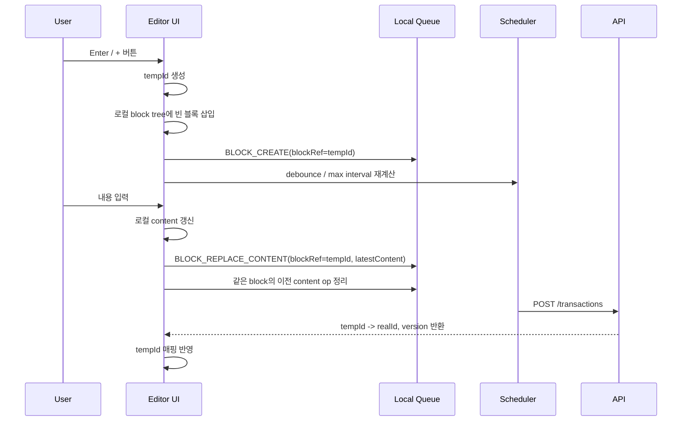
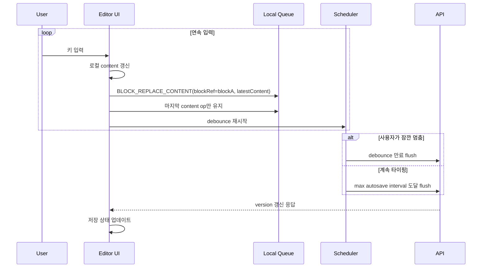
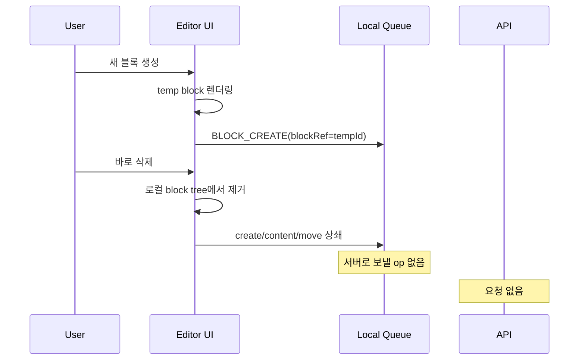
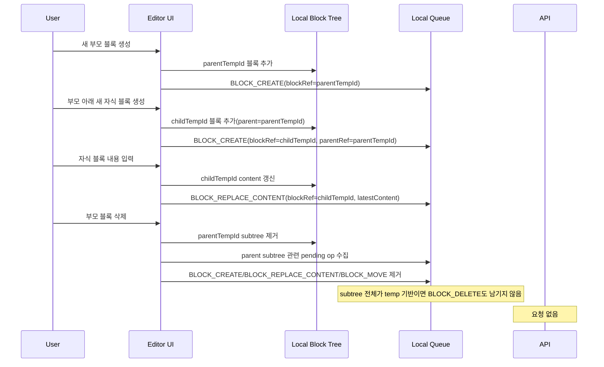
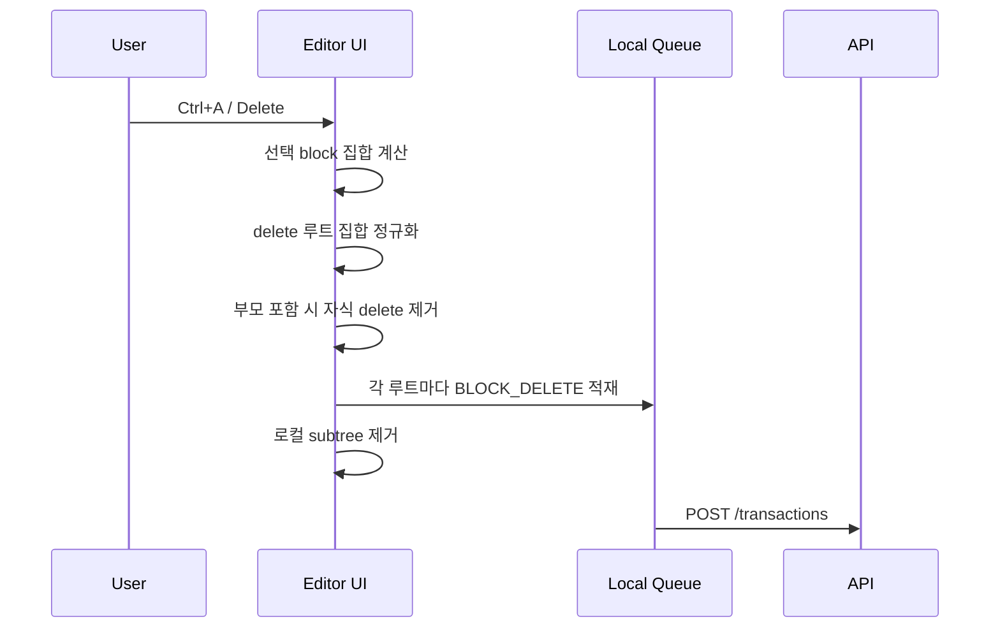
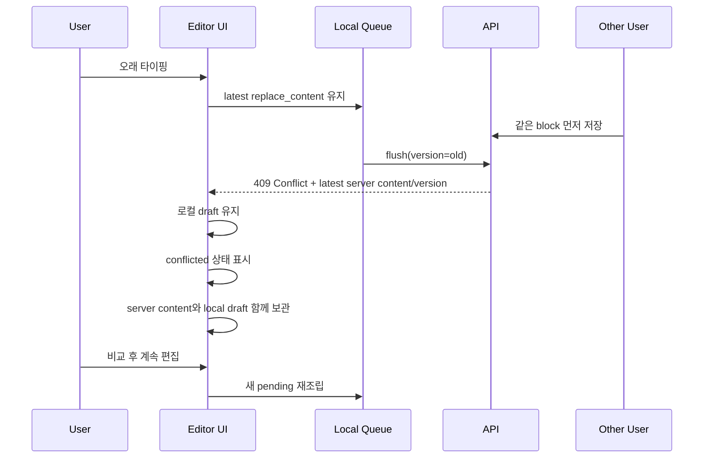

# Frontend Editor Transaction Implementation Guide

## 목적

이 문서는 프론트 구현자가 v1 에디터 저장 모델을 실제 코드로 옮길 때 필요한 기준을 한곳에 정리한 문서다.

이 문서만 읽어도 다음을 이해할 수 있도록 작성한다.

- 왜 에디터 저장을 단건 CRUD가 아니라 transaction queue로 다루는가
- 프론트가 어떤 상태를 들고 있어야 하는가
- 어떤 이벤트가 어떤 operation으로 바뀌는가
- 언제 flush하고, 실패하면 어떻게 처리하는가
- tempId, version, conflict를 어떻게 다뤄야 하는가

관련 문서:

- `docs/explainers/editor-transaction-save-model.md`
- `docs/discussions/2026-03-20-editor-save-api-boundary-and-transaction-design.md`
- `docs/discussions/2026-03-20-editor-transaction-dto-and-frontend-queue-spec.md`
- `docs/decisions/012-adopt-structured-text-content-and-staged-concurrency-roadmap.md`

---

## 1. 먼저 기억할 핵심

프론트는 에디터에서 발생한 변경을 즉시 서버로 보내지 않는다.

대신 다음 순서로 동작한다.

1. 로컬 UI 상태를 먼저 바꾼다.
2. 변경을 operation queue에 넣는다.
3. queue 안에서 의미 없는 중간 변경을 정리한다.
4. debounce 또는 명시적 flush 시점에 `POST /v1/documents/{documentId}/transactions` 한 번으로 보낸다.

즉 프론트 구현의 핵심은 "API 호출 코드"가 아니라 "로컬 상태 + queue + flush 제어"다.

---

## 2. 프론트가 가져야 하는 상태

문서 하나를 열었을 때 최소한 아래 상태가 있어야 한다.

### 문서 로컬 상태

- 현재 화면에 보이는 block tree
- 각 block의 현재 content
- 각 block의 현재 parent/정렬 위치
- 각 block의 현재 version

### queue 상태

- 아직 서버에 보내지 않은 pending operation 목록
- 현재 예약된 debounce timer
- 현재 전송 중인 batch 정보
- 전송 중 새 변경이 생겼는지 여부

### 매핑 상태

- `tempId -> realBlockId`

### 에러/저장 상태

- 마지막 저장 시각
- 저장 중 여부
- 충돌 발생 여부
- 충돌 대상 block 정보

권장 상태 이름 예:

- `blocksById`
- `rootBlockIds`
- `pendingOperations`
- `scheduledFlushAt`
- `inFlightBatch`
- `dirtyWhileInFlight`
- `tempIdMap`
- `saveStatus`

---

## 2.1 어떤 상태가 기존 content를 들고 있는가

프론트가 가장 자주 헷갈리는 지점은 "기존 content를 queue가 들고 있느냐"다.

기준은 다음과 같다.

- 서버에서 읽어온 현재 block content는 문서 로컬 상태에 들어간다.
- 사용자가 보고 수정하는 대상도 문서 로컬 상태다.
- queue는 그 로컬 상태를 서버에 반영하기 위한 pending operation만 들고 있다.
- 즉 기존 content의 원본은 queue가 아니라 로컬 editor state다.

이 구분이 중요한 이유는 `BLOCK_REPLACE_CONTENT`가 부분 diff가 아니라 "그 시점의 최종 content 전체"를 보내기 때문이다.

즉 프론트는 이전 pending content 뒤에 새 입력을 이어 붙여 다음 payload를 만드는 것이 아니다.
현재 editor state 전체를 다시 structured content로 직렬화하고, 같은 block의 마지막 `BLOCK_REPLACE_CONTENT`를 그 값으로 덮어쓴다.

정리:

- 로컬 상태: 현재 화면에서 사용자가 보고 있는 block의 실제 내용
- queue: 서버 반영 대기 중인 최종 operation
- 서버 snapshot: 마지막으로 서버와 합의된 기준 version/content

---

## 2.2 포커스 시점과 pending 생성 시점

포커스가 갔다고 해서 바로 queue에 `BLOCK_REPLACE_CONTENT`를 넣어야 하는 것은 아니다.

권장 기준:

- 새로고침 후 문서를 열면 서버 응답을 문서 로컬 상태에 적재한다.
- 블록에 포커스를 두는 것만으로는 queue를 만들지 않는다.
- 실제 편집 이벤트가 발생했을 때만 pending `BLOCK_REPLACE_CONTENT`를 만든다.
- 이후 같은 block에 대한 추가 입력, 삭제, 스타일 변경이 오면 기존 pending `BLOCK_REPLACE_CONTENT`를 최신 content 전체로 교체한다.

즉 기존 content는 "포커스 시 queue 적재"가 아니라 "이미 로컬 상태에 존재"하는 값이다.

---

## 3. 프론트가 직접 호출하는 표준 API

### 읽기

- `GET /v1/documents/{documentId}/blocks`

### 쓰기

- `POST /v1/documents/{documentId}/transactions`

프론트 에디터의 일반 편집 흐름은 이 두 개가 표준이다.

다음 API는 보조 경로로만 보고, 에디터 주 저장 경로에서는 기본적으로 사용하지 않는다.

- `POST /v1/documents/{documentId}/blocks`
- `PATCH /v1/blocks/{blockId}`
- `DELETE /v1/blocks/{blockId}`

즉 프론트 구현자는 "이벤트마다 다른 API를 호출한다"는 관점으로 접근하면 안 된다.

올바른 관점은 이렇다.

- 이벤트를 operation으로 바꾼다.
- operation들을 queue에 적재한다.
- queue를 transaction 요청으로 직렬화한다.

---

## 4. 이벤트를 operation으로 바꾸는 기준

v1에서 프론트가 다루는 operation은 4개다.

### 새 블록 만들기

- operation: `BLOCK_CREATE`
- 필요한 값:
- `blockRef`
- 새 block이면 여기에 `tempId`
- `parentRef`
- `afterRef`
- `beforeRef`

주의:

- `BLOCK_CREATE`는 위치만 다룬다.
- 본문은 비워 둔다.
- 생성 직후 입력 내용은 `BLOCK_REPLACE_CONTENT`가 맡는다.

### 블록 내용 바꾸기

- operation: `BLOCK_REPLACE_CONTENT`
- 필요한 값:
- `blockRef`
- 기존 서버 block이면 `version`
- 최종 structured content

주의:

- `blockRef`는 같은 batch 안의 새 block이면 `tempId`, 기존 block이면 실제 `blockId`다.
- 같은 batch 안의 새 block이면 `version`을 보내지 않는다.
- 기존 서버 block이면 batch 생성 시점에 클라이언트가 알고 있던 base `version`을 보낸다.
- 키 입력마다 서버 호출하지 않는다.
- queue에는 항상 "현재 최종 content"만 남도록 정리한다.

### 블록 이동

- operation: `BLOCK_MOVE`
- 필요한 값:
- `blockRef`
- 기존 서버 block이면 `version`
- `parentRef`
- `afterRef`
- `beforeRef`

주의:

- 같은 batch 안의 새 block이면 `version`을 보내지 않는다.
- 기존 서버 block이면 같은 batch 안의 여러 move/replace/delete가 이어져도 모두 같은 base `version`을 보낸다.

### 블록 삭제

- operation: `BLOCK_DELETE`
- 필요한 값:
- `blockRef`
- 기존 서버 block이면 `version`

주의:

- 삭제는 subtree 단위다.
- 부모와 자식이 동시에 삭제 대상이면 부모 delete만 남긴다.

---

## 5. tempId를 어떻게 쓸 것인가

새 블록은 서버 ID가 아직 없으므로 프론트가 임시 ID를 만든다.

예:

- `tmp:block:1`
- `tmp:block:2`

tempId는 다음 용도로 필요하다.

- 생성 직후 UI 렌더링
- 생성 직후 내용 입력
- 생성 직후 이동
- flush 전 delete 상쇄
- 응답 후 real ID로 치환

즉 tempId는 "새 블록이 서버에 아직 없지만, 프론트에서는 이미 존재하는 상태"를 표현하는 키다.

---

## 6. queue가 실제로 해야 하는 일

queue는 단순 배열이 아니다.

queue는 다음 정리 규칙을 수행해야 한다.

중요:

- 프론트는 사용자의 편집 순서를 그대로 무조건 서버에 보내는 것이 아니다.
- 프론트가 queue에서 중간 상태를 정리한 뒤 최종 batch를 만든다.
- 서버는 그 batch를 다시 coalescing하지 않고, 유효성 검증과 반영을 담당한다.

### 규칙 1. 같은 블록의 content 수정은 마지막 것만 남긴다

- 입력
- 스타일 적용
- 색상 변경

이런 변경이 짧은 시간 안에 여러 번 일어나도 queue에는 마지막 `BLOCK_REPLACE_CONTENT` 하나만 남긴다.

중요:

- 이 마지막 값은 방금 바뀐 부분만이 아니다.
- 그 block의 현재 전체 structured content다.
- 같은 block에 대한 이전 pending content가 있더라도 그것을 이어 붙이지 않고, 최신 전체 content로 덮어쓴다.

### 규칙 2. 생성 후 삭제는 상쇄한다

아직 flush 전인 새 블록이 삭제되면:

- `BLOCK_CREATE` 제거
- 관련 `BLOCK_REPLACE_CONTENT` 제거
- 관련 `BLOCK_MOVE` 제거

서버에는 아무것도 보내지 않는다.

### 규칙 3. 삭제된 블록의 후속 수정은 제거한다

블록이 delete 대상이면 그 뒤의

- `BLOCK_REPLACE_CONTENT`
- `BLOCK_MOVE`

는 의미가 없으므로 제거한다.

### 규칙 4. 이동은 마지막 위치만 남길 수 있다

같은 블록을 여러 번 옮겼다면 최종 위치 기준 `BLOCK_MOVE` 하나만 남길 수 있다.

### 규칙 5. 전체 선택 삭제는 루트 집합으로 정규화한다

부모와 자식이 함께 선택되었으면 부모만 delete 대상으로 남긴다.

즉 `create -> replace_content -> delete`가 같은 flush 전에 모두 일어났다면, 프론트는 이를 상쇄해서 서버에 보내지 않을 수 있어야 한다.

---

## 7. 추천 상태 머신

프론트는 아래 상태 머신으로 생각하면 구현이 쉬워진다.

### `idle`

- pending 없음
- in-flight 없음

### `scheduled`

- pending 있음
- debounce timer 대기 중

### `in_flight`

- 서버에 batch 전송 중

### `dirty_while_in_flight`

- in-flight 요청이 있는 동안 새 pending이 생김

흐름 예:

1. 입력 시작 -> `scheduled`
2. debounce 만료 -> `in_flight`
3. 응답 오기 전 새 입력 -> `dirty_while_in_flight`
4. 응답 성공 -> 새 pending 있으면 즉시 다음 flush, 없으면 `idle`

---

## 8. 언제 flush해야 하는가

### 기본

- 마지막 입력 후 debounce 만료

### 장시간 연속 입력 보호

- 사용자가 계속 타이핑해 debounce가 계속 밀리더라도, `max autosave interval`에 도달하면 강제 flush 한다.
- 즉 "입력을 멈추지 않으면 영원히 저장 안 됨" 상태를 허용하지 않는다.
- 구체적인 시간값은 구현에서 조정하되, 정책상 주기적 강제 flush가 필요하다.

### 즉시 flush 트리거 후보

- `Ctrl+S`
- page leave
- 에디터 바깥으로 나가기 직전
- 필요 시 Enter

주의:

- 모든 포커스 이동을 무조건 flush로 보면 요청이 과해질 수 있다.
- UX적으로 꼭 필요한 지점만 즉시 flush 트리거로 둔다.

권장 우선순위:

1. debounce 만료
2. max autosave interval 도달
3. `Ctrl+S`, page leave 같은 명시적 flush

---

## 9. transaction 요청을 만들 때

프론트는 queue 내부 구조를 그대로 보내지 말고, flush 직전에 서버 계약에 맞는 payload로 직렬화해야 한다.

예:

```json
{
  "clientId": "web-editor",
  "batchId": "uuid",
  "operations": [
    {
      "opId": "op-1",
      "type": "BLOCK_CREATE",
      "blockRef": "tmp:block:1",
      "parentRef": null,
      "afterRef": null,
      "beforeRef": null
    },
    {
      "opId": "op-2",
      "type": "BLOCK_REPLACE_CONTENT",
      "blockRef": "tmp:block:1",
      "content": {
        "format": "rich_text",
        "schemaVersion": 1,
        "segments": [
          {
            "text": "새 블록",
            "marks": []
          }
        ]
      }
    }
  ]
}
```

기존 서버 block에 대한 수정/이동/삭제에는 `version`을 반드시 넣어야 한다.
반대로 같은 batch 안의 temp block 대상 `BLOCK_REPLACE_CONTENT`, `BLOCK_MOVE`, `BLOCK_DELETE`에는 `version`을 넣지 않는다.
또한 대상 식별자는 `blockId`가 아니라 `blockRef`를 사용한다.

---

## 9.1 현재 서버가 보장하는 규칙

프론트 queue 구현은 아래 서버 규칙을 전제로 맞추는 것이 안전하다.

- transaction은 부분 성공이 아니라 전체 commit 또는 전체 rollback이다.
- `BLOCK_MOVE`, `BLOCK_REPLACE_CONTENT`는 요청이 유효하지만 실제 상태 변화가 없으면 `status=NO_OP`로 응답한다.
- `BLOCK_MOVE`, `BLOCK_REPLACE_CONTENT`의 no-op는 version을 올리지 않는다.
- `BLOCK_DELETE` 뒤 같은 batch에서 같은 block 또는 그 subtree 자식을 다시 `BLOCK_MOVE`, `BLOCK_REPLACE_CONTENT`로 참조하면 실패하고 전체 rollback 된다.
- 기존 서버 block에 대한 `BLOCK_REPLACE_CONTENT`, `BLOCK_MOVE`, `BLOCK_DELETE`는 현재 요청 `documentId` 소속 block만 허용한다.
- `BLOCK_MOVE`는 self-anchor, reversed anchor, same-anchor, target parent와 맞지 않는 anchor 조합을 잘못된 요청으로 거절한다.
- 같은 batch 안의 temp block은 앞선 operation 결과 version을 이어받는다.
- `create -> ... -> delete` 같은 temp 상쇄는 여전히 queue에서 collapse하는 것이 우선이지만, 혹시 남아 들어오더라도 서버는 temp delete를 version 없이 처리할 수 있다.
- 같은 batch 안의 기존 서버 block은 첫 참조에서 base `version`으로 동시성을 검증하고, 그 뒤 op들은 서버가 batch 내부 최신 version을 이어받아 처리한다.
- 대신 같은 real block에 대해 batch 안에서 서로 다른 base `version`을 섞어 보내면 conflict로 실패한다.

프론트 구현 기준:

- `NO_OP`는 실패가 아니라 정상 결과다.
- `INVALID_REQUEST`, `NOT_FOUND`, `CONFLICT`는 후속 op까지 포함해 batch 전체를 버리고 로컬 queue를 재구성해야 하는 실패다.
- 특히 기존 서버 block을 한 batch에서 여러 번 다뤄도, 프론트는 뒤 op의 version을 다시 계산하지 않는다.
- 같은 block의 뒤 op들도 처음 queue를 만들 때 기준으로 잡았던 같은 base `version`을 그대로 보낸다.

---

## 10. 프론트 전처리 시나리오

처음 구현할 때는 규칙만 보면 감이 잘 안 올 수 있다.
그래서 아래 시나리오 순서대로 생각하는 것이 좋다.

### 먼저 잡아야 할 공통 기준

- 새로고침 후 기존 content는 queue가 아니라 문서 로컬 상태에 올라온다.
- 포커스만으로는 보통 pending `BLOCK_REPLACE_CONTENT`를 만들지 않는다.
- 실제 편집이 일어날 때 현재 block 전체 content를 다시 직렬화해 pending 값을 만든다.
- debounce 시 서버로 가는 값도 "마지막에 남은 그 block의 전체 content"다.

### 시나리오 1. 새 블록 생성 후 바로 입력

1. 사용자가 Enter 또는 `+` 버튼을 누른다.
2. 프론트는 tempId를 만든다.
3. 로컬 block tree에 빈 블록을 먼저 넣는다.
4. queue에 `BLOCK_CREATE(blockRef=tempId)`를 넣는다.
5. 사용자가 바로 입력한다.
6. 로컬 content를 갱신한다.
7. queue에 `BLOCK_REPLACE_CONTENT(blockRef=tempId, latestContent)`를 넣는다.
8. debounce 또는 max autosave interval 시점에 create + replace_content를 함께 flush 한다.

구현 포인트:

- 새 블록을 서버 응답까지 기다렸다가 렌더링하면 UX가 나빠진다.
- tempId를 먼저 만들고 로컬 UI를 즉시 반영해야 한다.



### 시나리오 1-1. 기존 블록을 저장한 뒤 다시 이어서 입력

1. 서버에 저장된 block A content가 `"Hi"`라고 가정한다.
2. 새로고침 또는 최초 진입 시 프론트는 이 content를 문서 로컬 상태에 적재한다.
3. 사용자가 block A에 포커스를 둔다.
4. 이 시점만으로는 queue에 content operation을 넣지 않는다.
5. 사용자가 뒤에 `" there"`를 입력한다.
6. 프론트는 block A의 현재 editor state를 `"Hi there"`로 갱신한다.
7. queue에는 block A의 마지막 `BLOCK_REPLACE_CONTENT` 하나만 최신 전체 content 기준으로 갱신한다.
8. debounce 만료 시 `"Hi there"` 전체 content를 서버로 보낸다.

구현 포인트:

- 기존 content는 queue에서 가져오는 것이 아니라 로컬 editor state가 이미 들고 있다.
- 새 입력은 이전 pending payload 뒤에 수동으로 붙이는 것이 아니다.
- 현재 block 상태 전체를 다시 직렬화한 결과를 pending 값으로 본다.

### 시나리오 2. 계속 타이핑하는 동안 저장

1. 사용자가 같은 블록에서 연속 입력한다.
2. 입력마다 로컬 content를 갱신한다.
3. queue에는 같은 block의 마지막 `BLOCK_REPLACE_CONTENT`만 유지한다.
4. 사용자가 잠깐 멈추면 debounce로 flush 한다.
5. 사용자가 멈추지 않고 계속 타이핑해도 max autosave interval에 도달하면 강제 flush 한다.

구현 포인트:

- 키 입력마다 API 호출하지 않는다.
- debounce만 두면 오래 타이핑 시 저장이 계속 밀릴 수 있으므로 max interval이 필요하다.



### 시나리오 2-1. 잠깐 다른 작업 후 다시 같은 블록에 이어서 입력

1. block A의 현재 content가 `"Hi"`다.
2. 사용자가 block B를 이동한다.
3. queue에는 `BLOCK_MOVE(blockRef=blockB)`가 들어간다.
4. 사용자가 다시 block A로 돌아와 `" there"`를 입력한다.
5. 프론트는 block A의 로컬 content를 `"Hi there"`로 갱신한다.
6. queue에는 `BLOCK_MOVE(blockRef=blockB)`와 함께 block A의 최신 `BLOCK_REPLACE_CONTENT(blockRef=blockA)`가 공존한다.
7. flush 시 두 operation을 같은 transaction batch로 보낼 수 있다.

구현 포인트:

- 다른 block의 move/delete와 현재 block의 content 수정은 같은 queue 안에 함께 있을 수 있다.
- 본문 이어쓰기에 필요한 기준 데이터는 여전히 block A의 로컬 state다.
- queue는 여러 종류의 최종 operation을 한 번에 모으는 저장 대기 공간이지, 본문 조각을 이어 붙이는 캐시가 아니다.

### 시나리오 3. 새 블록을 만들었다가 바로 삭제

1. 사용자가 새 블록을 만든다.
2. queue에는 `BLOCK_CREATE(blockRef=tempId)`가 있다.
3. 아직 flush 전 상태에서 그 블록을 삭제한다.
4. 프론트는 로컬 block tree에서 해당 temp block을 제거한다.
5. queue에서 `BLOCK_CREATE`, 관련 `BLOCK_REPLACE_CONTENT`, 관련 `BLOCK_MOVE`를 함께 제거한다.
6. 서버에는 아무 요청도 보내지 않을 수 있다.

구현 포인트:

- 이 상쇄는 프론트가 한다.
- 서버에 create/delete를 그대로 보내는 모델이 아니다.



### 시나리오 3-1. 새로고침 후 queue가 비어 있는 상태에서 기존 content 뒤에 입력

1. 사용자가 문서를 새로고침한다.
2. 기존 pending queue는 사라진다.
3. 프론트는 서버에서 최신 block tree와 각 block content를 다시 읽어온다.
4. block A의 기존 content `"Hi"`가 문서 로컬 상태에 다시 올라온다.
5. 사용자가 block A 끝에 `" there"`를 입력한다.
6. 프론트는 로컬 state 기준으로 `"Hi there"`를 만든다.
7. queue에는 `"Hi there"` 전체 content를 담은 `BLOCK_REPLACE_CONTENT`가 새로 생긴다.

구현 포인트:

- 새로고침 후에는 이전 queue를 복원해서 이어 붙이지 않는다.
- 다시 로드한 서버 content가 새로운 시작점이 된다.
- 그 위에서 사용자가 만든 최신 로컬 상태 전체를 다음 pending content로 본다.

### 시나리오 4. 새 부모 블록 아래 새 자식 블록을 만들고, 마지막에 부모를 삭제

1. 사용자가 새 부모 블록을 만든다.
2. 프론트는 temp 부모 블록을 로컬에 추가하고 `BLOCK_CREATE(blockRef=parentTempId)`를 queue에 넣는다.
3. 사용자가 그 아래 새 자식 블록을 만든다.
4. 프론트는 temp 자식 블록을 로컬에 추가하고 `BLOCK_CREATE(blockRef=childTempId, parentRef=parentTempId)`를 queue에 넣는다.
5. 자식 블록에 내용을 입력한다.
6. 프론트는 `BLOCK_REPLACE_CONTENT(blockRef=childTempId, latestContent)`를 queue에 넣는다.
7. 아직 flush 전 상태에서 부모 블록을 삭제한다.
8. 프론트는 부모 subtree 전체를 로컬 tree에서 제거한다.
9. queue에서 부모/자식 subtree에 걸린 `BLOCK_CREATE`, `BLOCK_REPLACE_CONTENT`, `BLOCK_MOVE`를 모두 제거한다.
10. 부모 자체도 temp block이므로 `BLOCK_DELETE`는 남기지 않는다.
11. 결과적으로 서버에는 아무 요청도 가지 않을 수 있다.

구현 포인트:

- delete는 "한 블록 제거"가 아니라 "subtree 정리"로 다뤄야 한다.
- 삭제 root가 temp block이면 그 subtree 전체가 아직 서버에 없으므로 queue에서 전부 상쇄할 수 있다.
- 이때 queue 정리는 단순 배열 전체 탐색보다, 로컬 block tree 기준 subtree 수집 후 관련 pending op를 제거하는 방식이 더 자연스럽다.



### 시나리오 5. 블록을 여러 번 이동

1. 사용자가 블록을 여러 위치로 드래그한다.
2. 프론트는 매번 로컬 위치를 먼저 바꾼다.
3. queue에는 같은 block의 마지막 `BLOCK_MOVE`만 남긴다.
4. flush 시 최종 위치만 서버에 보낸다.

구현 포인트:

- 중간 이동 경로는 저장 가치가 없다.
- 마지막 위치만 서버에 남기면 된다.

### 시나리오 6. Ctrl+A 후 삭제

1. 사용자가 여러 블록을 선택하고 삭제한다.
2. 프론트는 선택된 블록 중 delete 루트만 남긴다.
3. 부모가 선택된 경우 자식 delete는 제거한다.
4. 각 루트마다 `BLOCK_DELETE`를 queue에 넣는다.
5. flush 시 delete root 집합을 한 batch로 보낸다.

구현 포인트:

- 선택된 모든 block을 그대로 delete op로 만들면 안 된다.
- subtree 중복 제거가 필요하다.



### 시나리오 7. 오래 타이핑 후 동시성 충돌

1. 사용자가 저장 없이 한 block을 오래 편집한다.
2. 다른 사용자가 먼저 같은 block을 저장한다.
3. 현재 사용자가 flush하면 `409 Conflict`가 난다.
4. 프론트는 실패한 in-flight batch는 종료 처리한다.
5. 하지만 현재 로컬 draft는 유지한다.
6. conflict 응답의 최신 서버 version/content도 함께 저장한다.
7. 사용자가 비교 후 계속 편집하면, 그 시점의 로컬 draft 기준으로 새 pending을 만든다.

구현 포인트:

- rollback은 서버 반영 기준이다.
- 로컬 draft를 바로 버리면 안 된다.



---

## 11. 성공 응답 처리

성공 응답을 받으면 프론트는 최소한 아래를 해야 한다.

- 응답 batch가 현재 in-flight batch와 같은지 확인
- stale 응답이면 무시
- `tempId -> realId` 매핑 반영
- 새 `version` 반영
- 새 `sortKey` 반영
- 성공한 pending operation 제거
- 저장 상태 갱신

중요:

- 서버 응답이 늦게 도착할 수 있다.
- 이미 더 최신 batch가 나갔다면 예전 응답을 그대로 적용하면 안 된다.
- 그래서 `batchId` 비교가 필요하다.

---

## 12. 실패 응답 처리

### 일반 실패

- 네트워크 오류
- 서버 오류

이 경우:

- pending은 유지
- 사용자에게 저장 실패 상태 표시
- 재시도 가능 상태 유지

### 충돌 실패

현재 v1 기준은 다음이다.

- 전체 rollback
- conflict block의 최신 `version`, 최신 `content` 반환

프론트는 이 경우:

- 로컬 미저장 변경을 바로 버리지 않는다.
- 실패한 in-flight batch와 현재 로컬 draft를 구분해서 관리한다.
- 충돌 block 식별
- 최신 서버 content와 로컬 content를 둘 다 보관
- 충돌 난 block의 로컬 version 기준은 최신 서버 version으로 갱신하고, pending operation은 다시 조립할 수 있어야 한다.
- 사용자에게 충돌 상태 표시
- 필요 시 재적용 또는 수동 선택 흐름 제공

즉 conflict는 "서버가 최신을 덮어써 주는 것"이 아니라 "클라이언트가 복구 결정을 해야 하는 상태"다.

### 시나리오: 오래 타이핑한 뒤 저장 시 동시성 충돌이 난 경우

이 시나리오를 기준으로 이해하면 쉽다.

- 사용자가 저장 없이 오래 타이핑한다.
- 다른 사용자가 같은 block을 먼저 저장한다.
- 이제 현재 사용자가 flush하면 `409 Conflict`가 난다.

이때도 현재 로컬 작업본은 바로 버리면 안 된다.

### 충돌 시 queue를 어떻게 다루는가

기본 원칙:

- 서버 rollback이 곧 클라이언트 queue 폐기를 의미하지는 않는다.
- in-flight로 보냈던 batch는 실패 처리한다.
- 하지만 현재 로컬 draft는 유지한다.
- 현재 로컬 draft 기준으로 다음 pending operation을 다시 계산한다.

추가 원칙:

- "다시 계산한다"는 것은 실패한 batch payload를 그대로 복사하는 것이 아니다.
- 현재 화면의 로컬 문서 상태를 기준으로 pending을 새로 조립하는 것이다.
- 같은 실패 batch 안에 있던 non-conflict operation도 서버에는 반영되지 않았으므로, 로컬 상태가 여전히 그 변경을 원하면 다시 pending에 포함될 수 있다.
- conflict 난 block은 최신 서버 snapshot과 로컬 draft를 함께 들고 있다가, 사용자 확인 뒤 다시 pending 대상으로 넣을 수 있어야 한다.
- 따라서 프론트는 "실패한 in-flight batch"와 "현재 로컬 상태에서 다시 계산한 pending queue"를 분리해서 생각해야 한다.

예:

1. block X version `3` 기준으로 `replace_content`를 보냈다.
2. 서버는 실제 version `4`라며 conflict를 반환했다.
3. 프론트는 block X를 충돌 상태로 표시한다.
4. 로컬 content는 그대로 둔다.
5. 서버 최신 content/version도 함께 상태에 저장한다.
6. 사용자가 비교 후 편집을 이어가면, 그 시점의 로컬 draft 기준으로 새 `replace_content` pending을 만든다.

즉 "큐 적재한 것이 다 날아간다"가 아니라, "그 batch는 실패했고 로컬 draft 기준으로 다시 pending을 만든다"가 맞다.

### 같은 batch 안에 non-conflict 작업도 있었던 경우

예를 들어 실패한 batch 안에 아래가 함께 있었다고 가정한다.

- block A `BLOCK_REPLACE_CONTENT`
- block B `BLOCK_MOVE`
- block C `BLOCK_DELETE`

그리고 block A만 version conflict였다고 해도, v1은 전체 rollback이므로 서버에는 A, B, C 모두 반영되지 않는다.

이때 프론트 기준은 다음과 같다.

- 실패한 in-flight batch 자체는 종료 처리한다.
- block A는 conflicted 상태로 표시한다.
- block A의 최신 서버 version/content를 별도 snapshot으로 저장한다.
- 로컬 문서 상태가 여전히 block B 이동, block C 삭제를 유지하고 있다면, 다음 pending 재조립 시 B와 C도 다시 queue에 들어갈 수 있다.
- block A도 사용자가 비교 후 로컬 draft를 계속 유지하기로 하면 다시 pending에 포함될 수 있다.

즉 전체 rollback 이후 프론트가 복구하는 대상은 "실패한 batch 원문"이 아니라 "현재 로컬 문서 상태 전체"다.

### 충돌 직후 문서 최신 반영을 어떻게 이해해야 하는가

충돌 응답을 받았다고 해서 문서 전체를 서버 최신으로 즉시 덮어쓰는 방식으로 이해하면 안 된다.

권장 기준:

- conflict 응답에 포함된 최신 서버 `content`, `version`은 충돌 난 block의 비교 기준 snapshot으로 저장한다.
- 현재 화면의 로컬 draft는 그대로 유지한다.
- 사용자는 local draft와 server snapshot을 보고 비교/재적용/수정 후 저장을 결정한다.

즉 v1에서 "문서 최신 반영"은 자동 전면 덮어쓰기가 아니라, "충돌 block의 최신 서버 기준을 프론트 상태에 함께 보관"하는 쪽에 가깝다.

---

## 13. 동시성에서 프론트가 꼭 기억할 것

version은 block 단위다.

즉:

- 블록 A 수정
- 블록 B 수정

은 서로 충돌하지 않을 수 있다.

반면 같은 블록을 두 사용자가 동시에 고치면 v1에서는 block 전체 충돌이다.

프론트는 "구간이 안 겹치니까 괜찮겠지"라고 가정하면 안 된다.

서버 충돌 기준은 block 전체다.

---

## 14. 실시간 협업과 혼동하면 안 되는 것

이 저장 모델은 autosave 모델이다.
실시간 협업 모델이 아니다.

즉 이 문서의 구현 범위는:

- 로컬 편집
- queue
- flush
- conflict

여기까지다.

다른 사용자에게 실시간 반영하려면 별도 기능이 필요하다.

- 원격 변경 수신
- WebSocket/SSE
- 원격 변경 적용 정책

v1 프론트 구현자는 이 둘을 섞어서 설계하면 안 된다.

---

## 15. 추천 구현 순서

### 1단계

- block tree 로컬 상태 관리
- structured content 편집 상태 연결

### 2단계

- operation 타입 정의
- tempId 정책 정의
- queue 자료구조 정의

### 3단계

- coalescing 규칙 구현
- debounce scheduler 구현

### 4단계

- `POST /transactions` 직렬화
- 성공 응답의 tempId/version 반영

### 5단계

- conflict 처리 UI
- 재시도/저장 실패 상태 UI

### 6단계

- `Ctrl+S`, page leave, 선택 삭제, Enter 같은 트리거 연결

---

## 16. 구현자가 마지막으로 체크할 질문

- 지금 이 이벤트는 즉시 API 호출인가, operation 적재인가
- 이 블록은 서버 block인가, temp block인가
- queue에 같은 의미의 이전 operation이 남아 있지 않은가
- 이 delete는 subtree 루트 기준으로 정규화되었는가
- flush 응답이 현재 batch에 대한 것인가
- conflict가 나면 로컬 변경을 잃지 않도록 처리했는가

이 질문에 모두 답할 수 있어야 프론트 저장 구현이 안정적이다.
